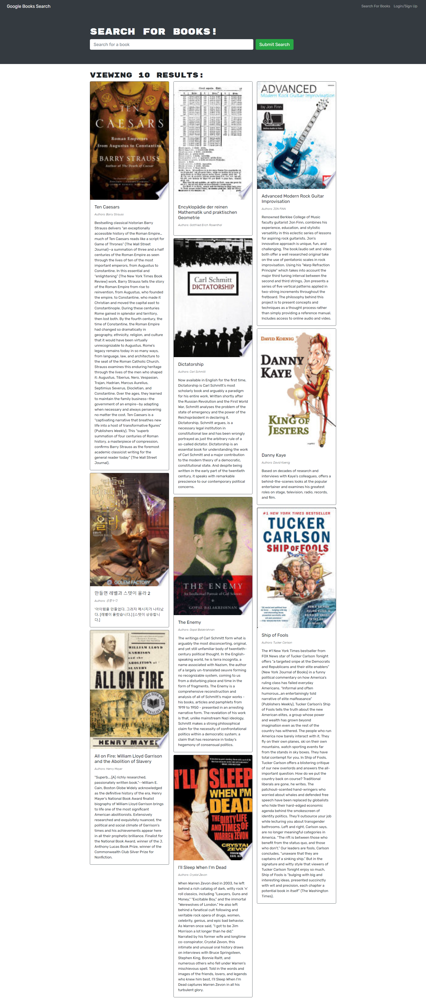

# graphQL-Book-Search

## Description

This is my Mern stack application showing how all the different libraries work together to create one app for searching books from the google book engine.

## Table of Contents

1. [Description](#description)
2. [Installation](#installation)
3. [Usage](#usage)
4. [Image](#screenshot)
5. [Collaboration](#collaboration)
6. [Tests](#tests)
7. [Questions?](#questions?)
8. [GitHub](#gitHub)
9. [License](#license)

## Installation

- `git clone ` application to your local machine.
- `npm i `
- `npm develop`

- Live site can be found at https://mysterious-eyrie-45288.herokuapp.com/
  

## Screenshot

[

## Collaboration

For now, just follow the [Contributor Covenant](https://www.contributor-covenant.org/)

## Tests

none yet

## Questions?

Please contact me at

- Zachary Clark [GitHub](https://github.com/zaclark369)

## Credits

